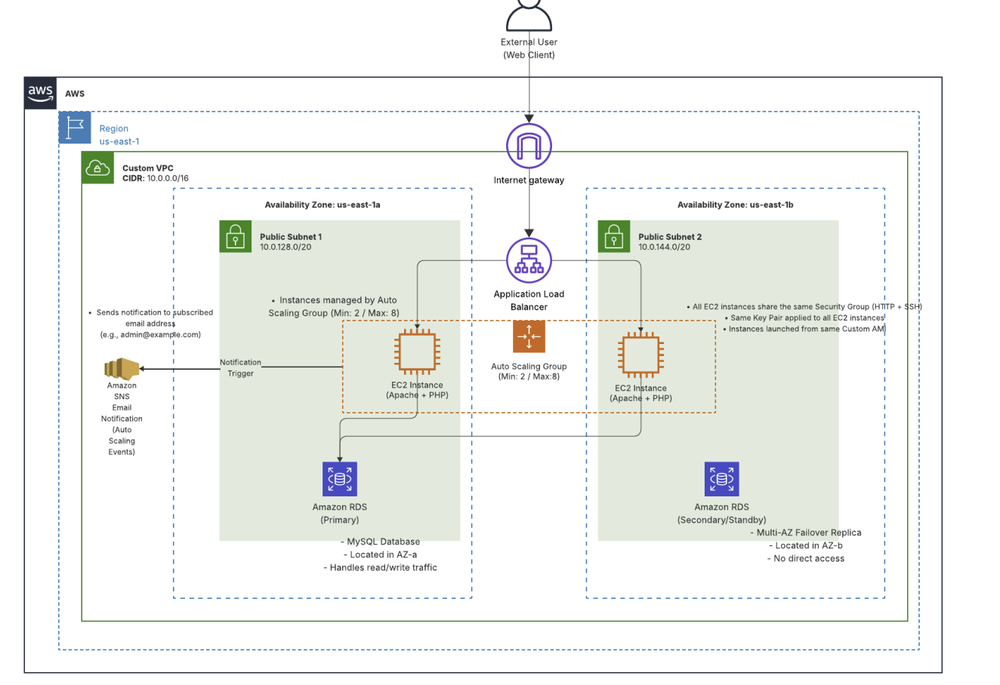

# Scalable AWS Web Architecture (Auto Scaling + Multi-AZ RDS)

## Overview
This project demonstrates a scalable and highly available web architecture deployed on the AWS cloud platform.

The system was designed and implemented using multiple AWS services including EC2, Application Load Balancer, Auto Scaling Group, Amazon RDS (Multi-AZ), and Amazon SNS. The architecture distributes traffic across multiple instances, automatically scales infrastructure based on demand, and ensures high availability through Multi-AZ deployment.

This project was implemented as part of a cloud architecture assignment, but the infrastructure was **actually deployed and tested on the AWS platform**.

---

## Architecture Diagram

The architecture includes:

- Application Load Balancer distributing traffic
- Auto Scaling EC2 instances across multiple AZs
- Multi-AZ RDS database for high availability
- SNS notifications for infrastructure monitoring
- Custom VPC network configuration

The system is designed to support scalability, reliability, and disaster recovery.

---

## AWS Services Used

- Amazon EC2 (Custom AMI)
- Application Load Balancer (ALB)
- Auto Scaling Group (ASG)
- Amazon RDS (MySQL – Multi-AZ)
- Amazon SNS (Email Notifications)
- Amazon VPC
- Subnets
- Security Groups
- Key Pair
- Internet Gateway

---

## Architecture Design

### 1. EC2 (Custom AMI)
Amazon EC2 instances host the web application servers.

A **custom AMI with a pre-installed LAMP stack** was used to ensure that all instances launch with the same environment. This enables consistent deployments and faster scaling when new instances are created in the Auto Scaling Group. :contentReference[oaicite:1]{index=1}

---

### 2. Auto Scaling Group
The Auto Scaling Group automatically adjusts the number of EC2 instances depending on traffic conditions.

Configuration used in this project:

- Minimum instances: **2**
- Maximum instances: **8**
- Scaling trigger:
  - CPU > 60% → launch new instance
  - CPU < 30% → terminate instance

This allows the system to maintain performance during high traffic while also reducing costs when demand decreases. :contentReference[oaicite:2]{index=2}

---

### 3. Application Load Balancer
The Application Load Balancer distributes incoming user requests across multiple EC2 instances.

It performs **health checks** to ensure traffic is only routed to healthy instances, improving system reliability and preventing overload on a single server. :contentReference[oaicite:3]{index=3}

---

### 4. Amazon RDS (Multi-AZ)
The database layer uses **Amazon RDS with Multi-AZ deployment**.

A standby replica is automatically created in a different Availability Zone. If the primary database fails, the system automatically performs a failover to the standby instance, ensuring minimal downtime and strong disaster recovery capability. :contentReference[oaicite:4]{index=4}

---

### 5. Amazon SNS
Amazon SNS is used to send **email notifications when Auto Scaling events occur**.

Notifications are triggered when instances are launched or terminated, allowing administrators to monitor infrastructure changes in real time. :contentReference[oaicite:5]{index=5}

---

### 6. Network Architecture
The system is deployed in a **custom VPC** with two public subnets located in different Availability Zones.

This setup provides:

- network isolation
- fault tolerance
- high availability across multiple AZs

All major services (EC2, ALB, RDS, SNS) are configured within this VPC environment. :contentReference[oaicite:6]{index=6}

---

## System Features

### Scalability
The combination of **Auto Scaling Group and Application Load Balancer** allows the system to automatically scale based on traffic demand.

New instances are created when CPU usage exceeds defined thresholds, while idle instances are terminated when demand decreases. :contentReference[oaicite:7]{index=7}

---

### High Availability
Instances are distributed across **multiple Availability Zones**, ensuring the system remains operational even if one zone experiences failure.

---

### Disaster Recovery
The system uses **Amazon RDS Multi-AZ deployment**, which enables automatic failover to a standby database instance in case of primary database failure. :contentReference[oaicite:8]{index=8}

---

### Monitoring and Notifications
Amazon SNS provides infrastructure visibility by notifying administrators when Auto Scaling events occur.

---

## Deployment Region
us-east-1

---

## Assumptions

- Users access the system through the Application Load Balancer.
- EC2 instances are created using a custom AMI with a preconfigured web server environment.
- Auto Scaling triggers based on EC2 instance traffic metrics.
- All infrastructure components are deployed within a custom VPC.
- SNS notifications are delivered via email to subscribed users.

---

## Project Purpose

The goal of this project was to design and deploy a **scalable and fault-tolerant cloud architecture using AWS services**.

Through this implementation, I gained hands-on experience with:

- AWS infrastructure design
- Auto Scaling configuration
- Load balancing
- Multi-AZ database deployment
- Cloud monitoring and notification systems
